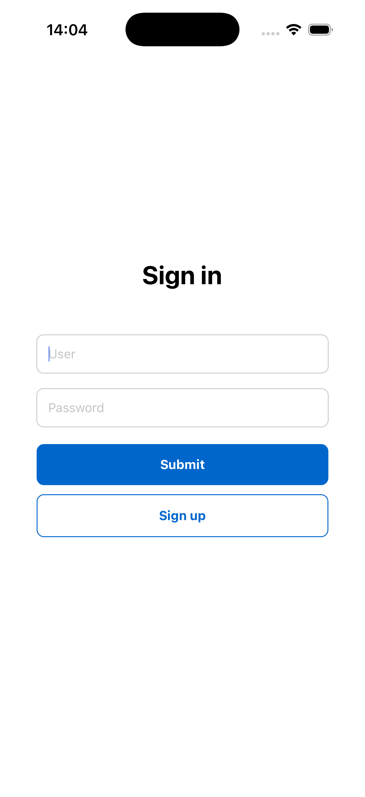
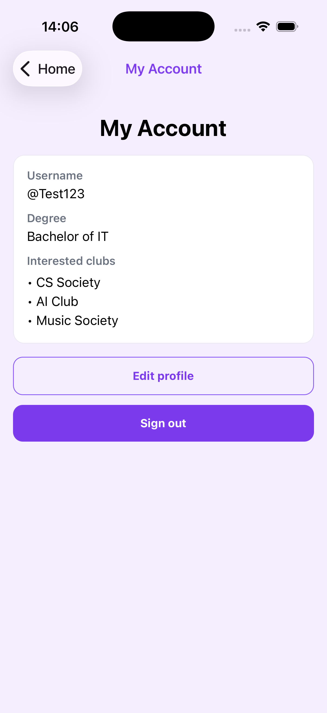
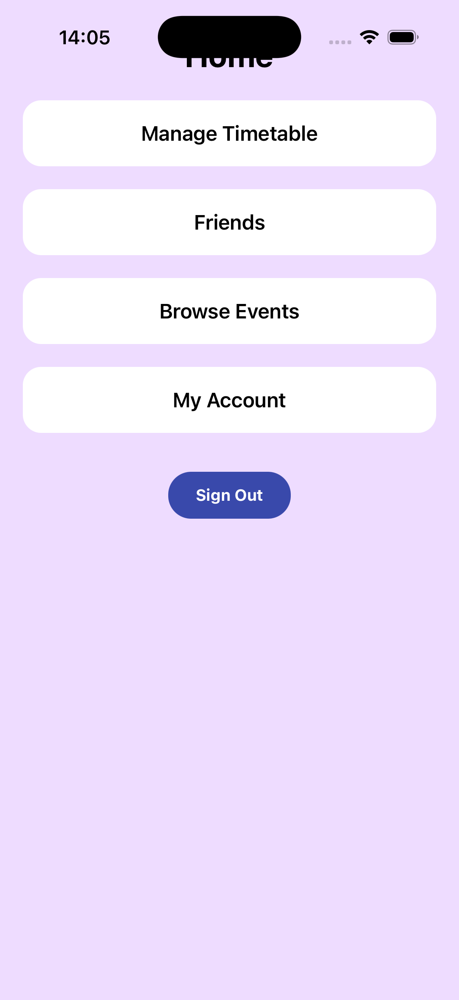
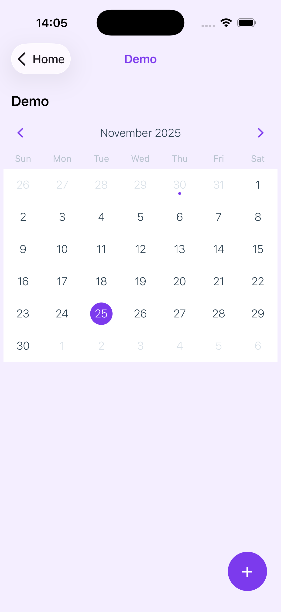
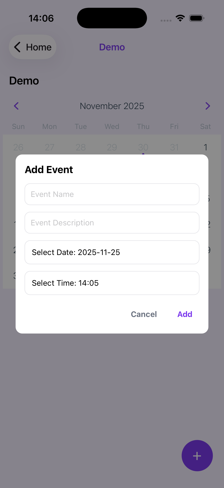
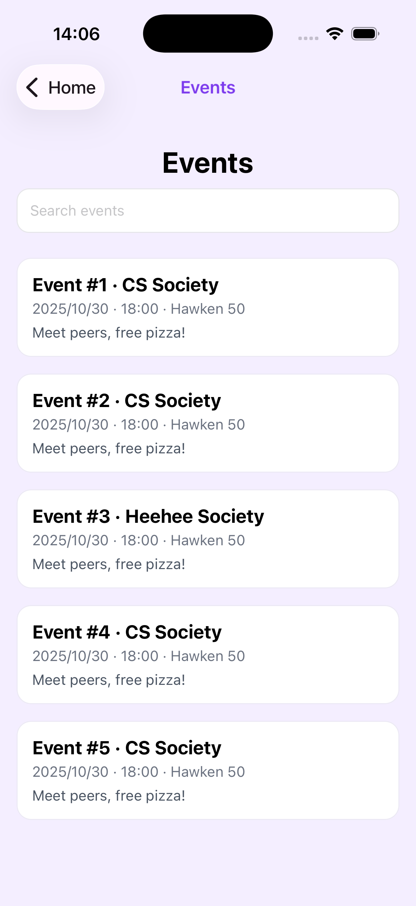
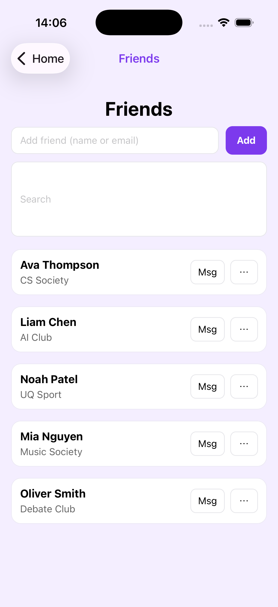
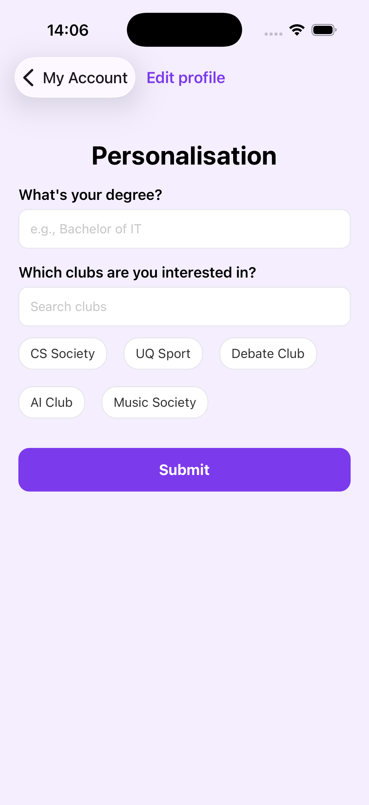

## Overview
CampusConnect is a mobile application developed as part of the Introduction to Software Innovation course at The University of Queensland. Built using npm-based tooling, the app aims to streamline the student experience by centralizing extracurricular and campus event information into a single, intuitive platform. It also integrates with the UQ class timetable, allowing students to manage both academic and social commitments seamlessly in one place.

## Functionality
Core functionality includes a consolidated event feed, the ability to add activities directly into a timetable-style planner, and a dedicated timetable view with export options (e.g., Google Calendar). Students can block out parts of their day, label them as busy, or add custom event details with optional location privacy controls. Additional features enhance personalization and collaboration, such as sharing timetables with friends, checking schedule compatibility, filtering out clashing events, and receiving recommendations based on free time, interests, field of study, club memberships, and event popularity.


## How to run the Project
This is an [Expo](https://expo.dev) project created with [`create-expo-app`](https://www.npmjs.com/package/create-expo-app).


1. Install dependencies

   ```bash
   npm install
   ```

2. Start the app

   ```bash
   npx expo start
   ```

   if this doesn't work 

   ```bash
   cd directory
   npm run start
   ```

In the output, you'll find options to open the app in a

- [development build](https://docs.expo.dev/develop/development-builds/introduction/)
- [Android emulator](https://docs.expo.dev/workflow/android-studio-emulator/)
- [iOS simulator](https://docs.expo.dev/workflow/ios-simulator/)
- [Expo Go](https://expo.dev/go), a limited sandbox for trying out app development with Expo

You can start developing by editing the files inside the **app** directory. This project uses [file-based routing](https://docs.expo.dev/router/introduction).

## Get a fresh project

When you're ready, run:

```bash
npm run reset-project
```

## Sample UI 









